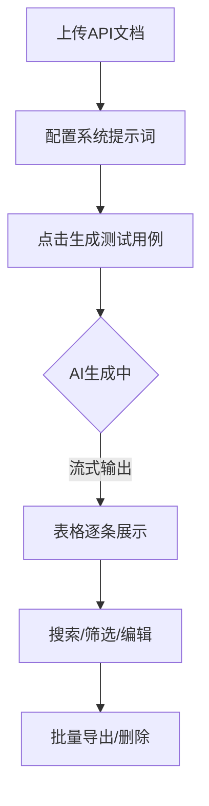

## 1. Product Overview
API测试用例管理Web工具，基于阿里百炼API实现AI驱动的测试用例生成与管理。帮助测试工程师高效管理API测试用例，支持从接口文档自动生成测试用例，提供可视化表格展示和批量操作功能。

## 2. Core Features

### 2.1 User Roles
| Role | Registration Method | Core Permissions |
|------|---------------------|------------------|
| Normal User | Local usage, no registration | Upload files, generate test cases, manage test cases |

### 2.2 Feature Module
1. **主页面**: 左侧配置区、右侧测试用例表格、顶部搜索筛选
2. **文件上传**: 支持上传API文档，自动解析并生成测试用例
3. **AI生成**: 通过阿里百炼API生成测试用例，支持流式输出
4. **测试用例管理**: 表格展示、搜索筛选、批量导出/删除、列自定义

### 2.3 Page Details
| Page Name | Module Name | Feature description |
|-----------|-------------|---------------------|
| 主页面 | 左侧配置区 | 文件上传、系统提示词输入、生成/导出/清除按钮 |
| 主页面 | 顶部统计 | 饼图展示正例/异常例/边界例比例 |
| 主页面 | 搜索筛选 | 全局搜索和模块筛选 |
| 主页面 | 测试用例表格 | 斑马纹、hover高亮、冻结列、可调整列宽 |
| 主页面 | 请求体展开 | JSON语法高亮、格式化、折叠层级 |

## 3. Core Process
用户上传API文档 → 配置系统提示词 → 点击生成测试用例 → AI流式输出 → 表格展示 → 搜索/筛选/批量操作 → 导出Excel

## 4. User Interface Design

### 4.1 Design Style
- Primary color: #3B82F6 (blue)
- Secondary colors: #10B981 (green), #EF4444 (red), #F59E0B (yellow)
- Button style: rounded-lg, shadow-sm, hover shadow-md
- Font: Inter (clean, professional)
- Layout: Sidebar + Main content, card-based
- Icon style: Lucide icons

### 4.2 Page Design Overview
| Page Name | Module Name | UI Elements |
|-----------|-------------|-------------|
| 主页面 | 左侧配置区 | 宽度300px，文件上传框，提示词输入框，底部固定按钮组 |
| 主页面 | 顶部统计 | 饼图组件，统计数据展示 |
| 主页面 | 搜索筛选 | 搜索输入框，模块下拉选择器 |
| 主页面 | 测试用例表格 | 固定表头，冻结序号和标题列，斑马纹背景，hover高亮 |
| 主页面 | 请求体展开 | 代码块组件，语法高亮，折叠按钮 |

### 4.3 Responsiveness
- Desktop-first design
- Mobile: 左侧配置区转为底部抽屉，表格自适应滚动
- Touch optimization for mobile devices

### 4.4 Data Visualization
- Pie chart for case type distribution (正例/异常例/边界例)
- Status indicators for request methods (POST/GET/DELETE)