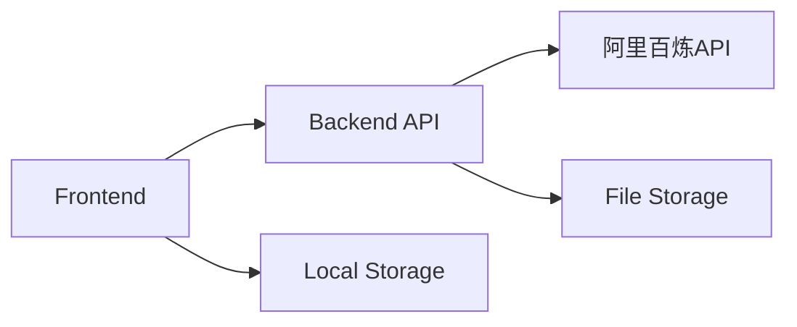
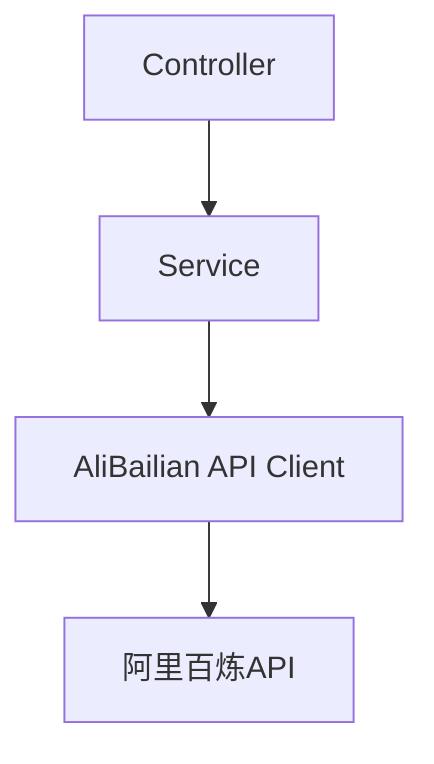
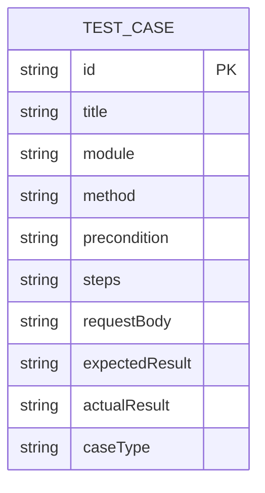

## 1. Architecture Design


## 2. Technology Description
- Frontend: React@18 + TypeScript + tailwindcss@3 + vite
- Initialization Tool: vite-init
- Backend: Express@4 + TypeScript
- AI Service: 阿里百炼API
- File Handling: Local file parsing
- State Management: Zustand
- Icons: Lucide React
- Charts: Recharts
- Excel Export: XLSX

## 3. Route Definitions
| Route | Purpose |
|-------|---------|
| / | Main page with test case management |

## 4. API Definitions

### 4.1 Backend Routes
| Route | Method | Purpose | Request Body | Response |
|-------|--------|---------|--------------|----------|
| /api/generate | POST | Generate test cases via AI | { document: string, prompt: string } | Stream of test case objects |
| /api/health | GET | Health check | - | { status: 'ok' } |

### 4.2 Test Case Type
```typescript
interface TestCase {
  id: string;
  title: string;
  module: string;
  method: 'POST' | 'GET' | 'DELETE';
  precondition: string;
  steps: string;
  requestBody: string;
  expectedResult: string;
  actualResult: string;
  caseType: 'normal' | 'exception' | 'boundary';
}
```

## 5. Server Architecture Diagram


## 6. Data Model

### 6.1 Data Model Definition


### 6.2 Storage
- Frontend: LocalStorage for persisting test cases
- No external database required for MVP

## 7. Project Structure
```
src/
├── components/
│   ├── Sidebar/
│   │   ├── FileUploader.tsx
│   │   ├── SystemPrompt.tsx
│   │   └── ActionButtons.tsx
│   ├── Table/
│   │   ├── TestCaseTable.tsx
│   │   ├── TableHeader.tsx
│   │   ├── TableRow.tsx
│   │   └── JsonExpander.tsx
│   ├── SearchFilter.tsx
│   └── StatisticsChart.tsx
├── hooks/
│   └── useTestCases.ts
├── store/
│   └── testCaseStore.ts
├── utils/
│   ├── aiClient.ts
│   ├── excelExporter.ts
│   └── jsonFormatter.ts
├── types/
│   └── index.ts
├── App.tsx
└── main.tsx
```